# Cinema
- [Demo play](https://www.youtube.com/watch?v=_DUu1m2XeFs&list=PLsUNj5RBJbY0BANflOhiOX2CwOj5c6bkb&index=1)
- [발표 ppt](https://github.com/uiyoung/Cinema/blob/master/cinemaV.pptx)
- [wiki](https://github.com/UiyoungSeo/Cinema/wiki)  

## About
Cinema는 영화관 관리자를 위한 **CinemaManager**와 영화관을 이용하는 유저를 위한 **CinemaClient**로 구성되어 있습니다.

### [1. CinemaManager](https://github.com/uiyoung/Cinema/tree/master/CinemaManager) 기능
사용자가 영화를 예매할 수 있도록 관리자가 극장정보, 영화정보, 상영정보, 좌석정보를 db에 입력하고 예매현황과 영화별 수익, 총 수익을 확인할 수 있습니다.
- 영화정보입력 : `①극장생성->②영화정보입력->③ 상영스케줄입력`
- 예매정보 확인 : 현재 예매 현황 확인
- 정산 : 영화별 수익, 전체 수익 확인

### [2. CinemaClient](https://github.com/uiyoung/Cinema/tree/master/CinemaClient) 기능
유저는 회원가입을 하고 영화정보를 db에서 불러와 확인하고 영화, 극장, 날짜, 시간, 좌석을 선택하여 티켓을 예매할 수 있습니다.
- 영화예매 : `회원가입->로그인->메뉴->상영영화정보->영화선택->극장선택->날짜선택->시간선택->좌석선택->결재`
- MyTicket : 예매정보확인, 예매취소
- MyAccount : 회원정보수정, 탈퇴

## How to run
#### 1. git 주소 복사
`Clone or download->copy to clipboard`

#### 2. eclipse에서 import하기
`eclipse->file->import->Git->Projects from Git->Clone URI`   

#### 3. MySQL 커넥터 연결하기
`Project->Properties->Java Build Path->Libraries->Add External JARs`

#### 4. DB
예전의 cinemaDB 데이터베이스가 존재한다면, `drop database cinemaDB;` db드롭 후에 
[SQL파일](https://github.com/uiyoung/Cinema/blob/master/cinemaDB_create.sql) 열어서 Execute All Queries

---

## 사용방법

### [1. CinemaManager 영화관 관리](https://github.com/uiyoung/Cinema/tree/master/CinemaManager)
이제 모든 데이터는 관리자프로그램을 이용해서 db에 집어넣습니다. 따라서 관리자 프로그램에서 순서대로 `①극장생성->②영화정보입력->③상영스케줄입력`을 해야 사용자가 예매프로그램에서 예매를 할 수 있습니다.
`CinemaManger에서 views.login 패키지의 Login.java를 실행합니다.`

#### Sigin In
관리자의 아이디와 비밀번호를 입력하여 로그인 합니다.

#### main 화면
영화관 관리, 영화 관리, 스케줄 관리, 예약정보, 정산 중 원하는 버튼을 클릭합니다.
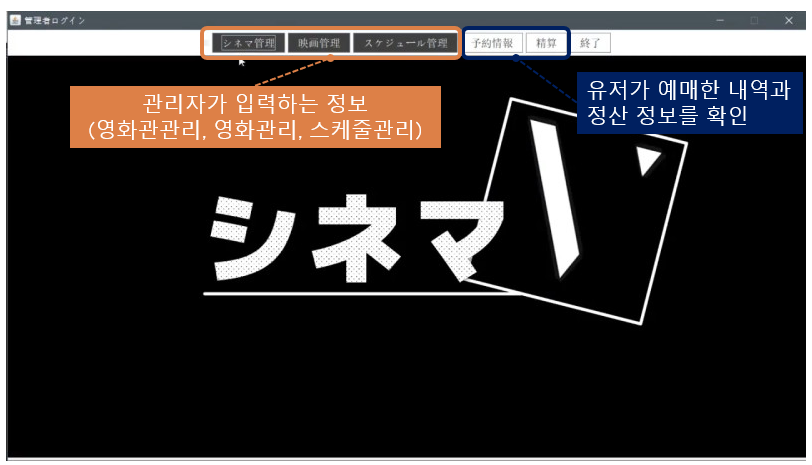

#### ①극장정보 등록
극장관리에서 추가버튼을 누르고 극장번호와 이름을 입력하세요. 극장번호에는 숫자만 넣을 수 있습니다. 나머지 정보는 입력하지 않아도 등록가능합니다.

#### ②영화정보 등록
영화관리에서 등록버튼을 누르고 사용자에게 보여질 영화에 대한 정보를 입력할 수 있습니다. 
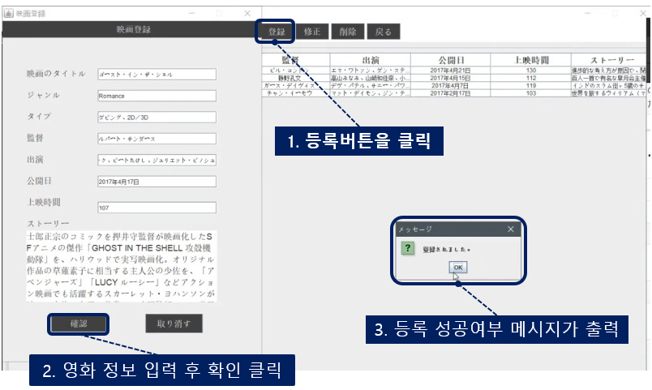

지금은 영화제목이 아래와 같을 때만 *(CinemaClient의 images폴더안에 있는 이미지파일)* 예매 프로그램에서 포스터가 보입니다.     
[영화정보입력예시](https://github.com/uiyoung/Cinema/blob/master/CinemaManager/InsertMovieExample.md)
- 美女と野獣
- 名探偵コナン　から紅の恋歌（ラブレター）
- ゴースト・イン・ザ・シェル
- グレートウォール
- LION／ライオン ～25年目のただいま

#### ③ 상영스케줄 등록
스케줄관리에서 등록버튼을 누르고 언제, 어떤영화를, 어느 극장에서 상영할지 스케줄을 만들어주세요. 이 조건에 맞는 스케줄만 사용자 프로그램에서 예매 할 수 있습니다.
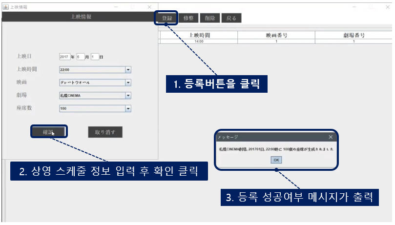

#### ④ 예매 확인
현재 예매 현황을 확인할 수 있습니다.
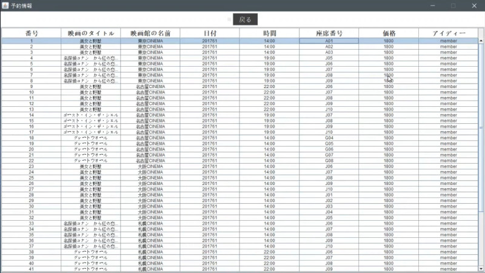

#### ⑤ 정산 확인
영화별 수익, 전체 수익 정보를 확인 할 수 있습니다.
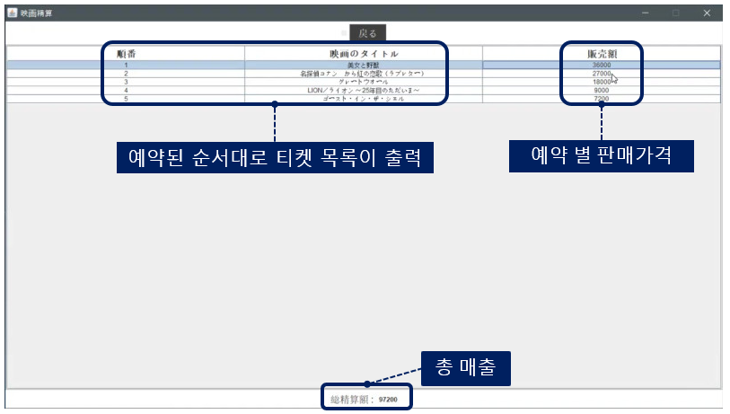

---

### [2. CinemaClient 예매하기](https://github.com/uiyoung/Cinema/tree/master/CinemaClient)
관리자가 입력한 영화정보를 db에서 불러와 확인하고 영화, 극장, 날짜, 시간, 좌석을 선택하여 티켓을 예매할 수 있습니다.    
 `CinemaClient에서 views.login 패키지의 Login.java를 실행합니다.`   

#### Sign In
유저의 아이디와 비밀번호를 입력하여 로그인 합니다.
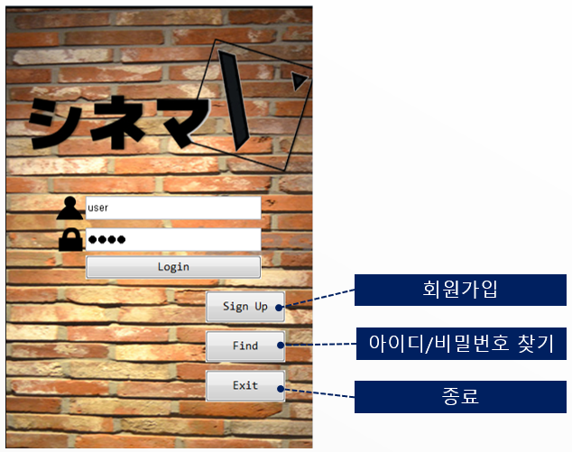

#### main 화면
영화정보 보기, 예약하기, MyTicket, MyAccount, 로그아웃, 종료 버튼을 선택할 수 있습니다.
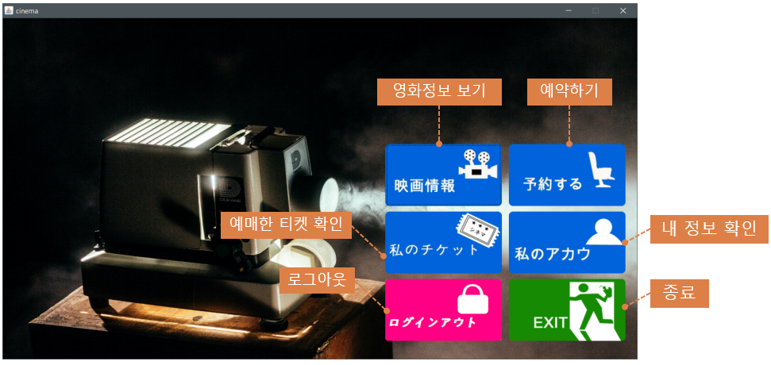

#### 영화정보 보기
상영중인 영화의 정보를 확인하고 예매페이지로 넘어갈 수 있습니다.
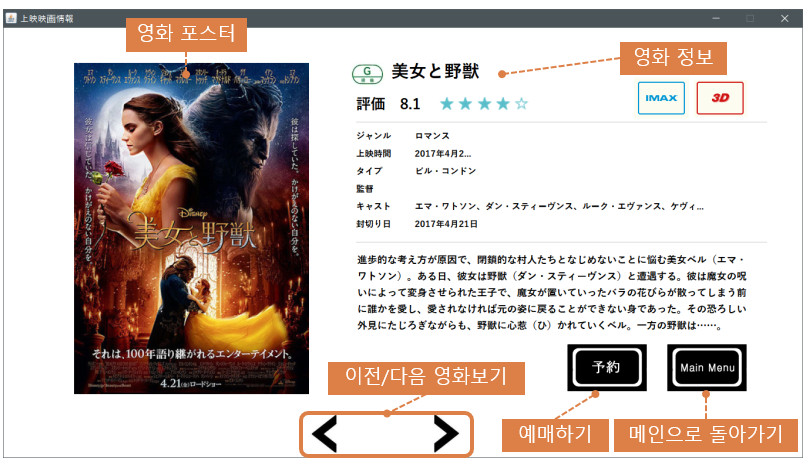

#### 영화예매 하기 
상영중인 영화의 정보를 확인하고 영화를 선택 후 극장과 날짜 상영시간 그리고 좌석을 선택 후 예매 할 수 있습니다.
`회원가입->로그인->메뉴->상영영화정보->영화선택->극장선택->날짜선택->시간선택->좌석선택->결재->완료`
- 영화선택, 극장선택, 날짜선택, 시간선택
![Reserve]](./img/client/resever.png)
- 좌석 선택
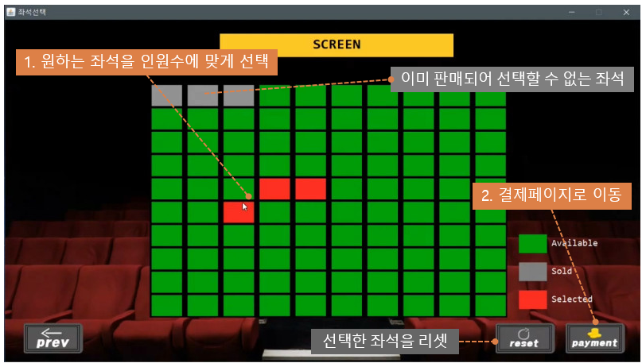
- 결재방법 선택
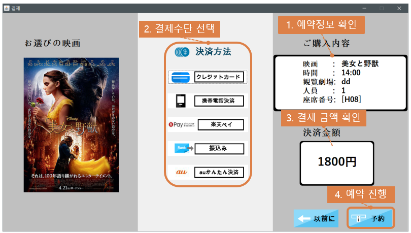

#### MyTicket
예매한 티켓의 정보확인, 예매취소를 할 수 있습니다.
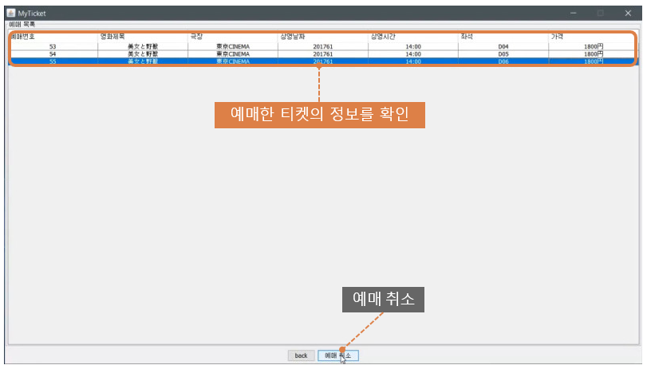

#### MyAccount
회원정보 확인, 수정, 탈퇴를 할 수 있습니다.
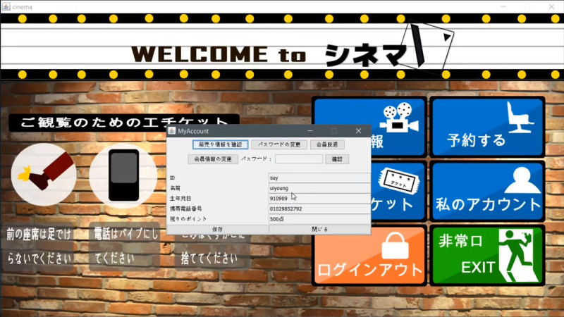
